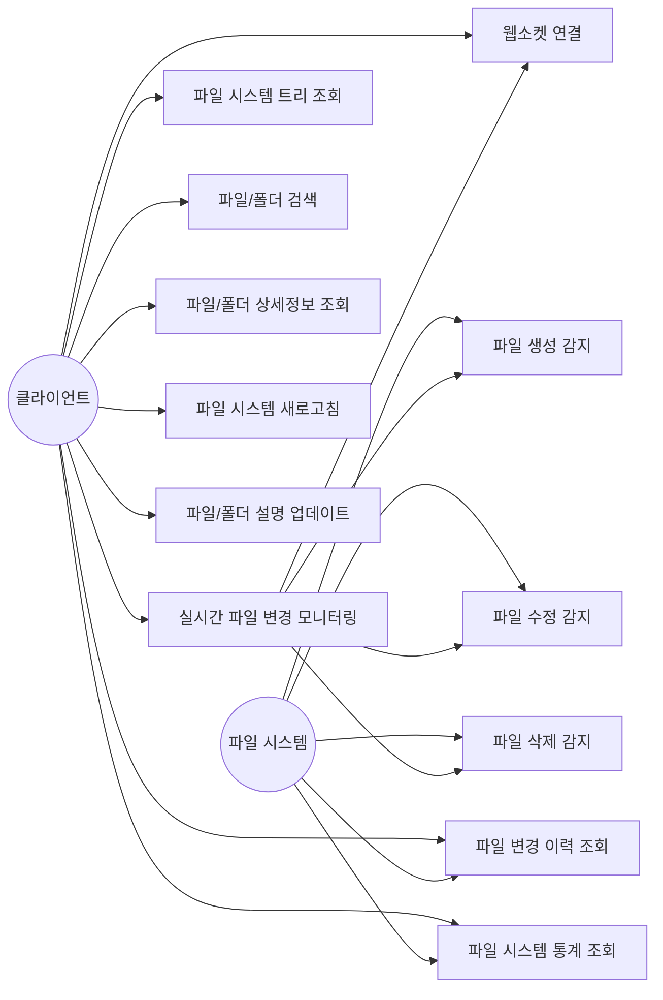
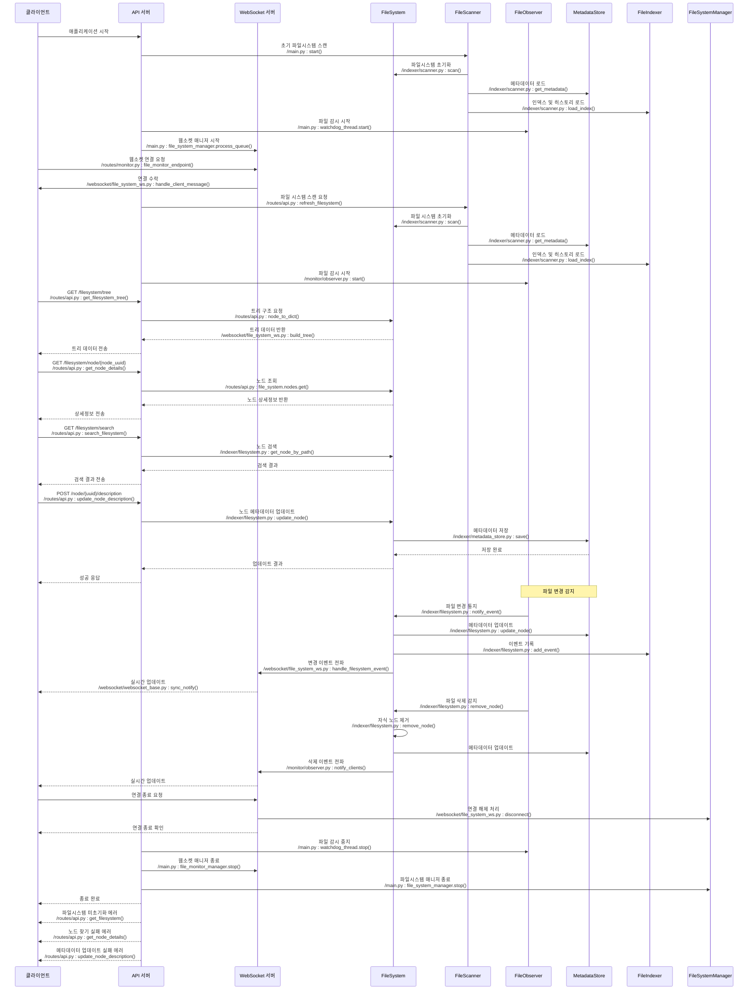
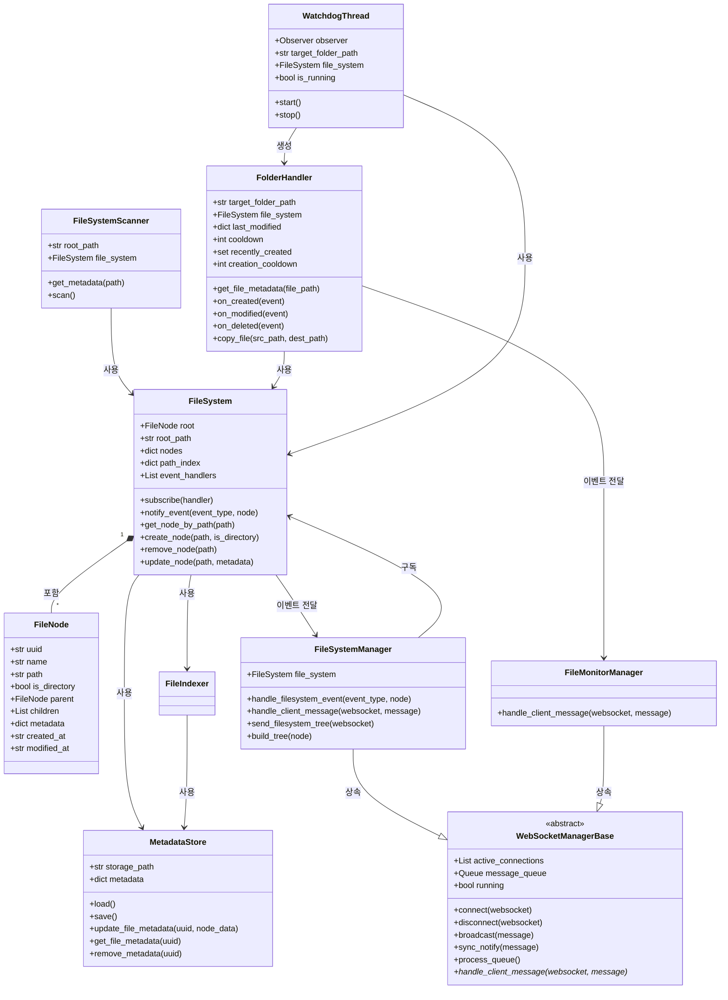

hello

```mermaid
graph LR
    %% 액터 정의
    Client((클라이언트))
    FileSystem((파일 시스템))

    %% 유즈케이스 정의
    ViewTree[파일 시스템 트리 조회]
    Search[파일/폴더 검색]
    ViewDetails[파일/폴더 상세정보 조회]
    Refresh[파일 시스템 새로고침]
    UpdateDesc[파일/폴더 설명 업데이트]
    Monitor[실시간 파일 변경 모니터링]
    WSConnect[웹소켓 연결]
    Created[파일 생성 감지]
    Modified[파일 수정 감지]
    Deleted[파일 삭제 감지]
    ViewHistory[파일 변경 이력 조회]
    ViewStats[파일 시스템 통계 조회]

    %% 관계 정의
    Client --> ViewTree
    Client --> Search
    Client --> ViewDetails
    Client --> Refresh
    Client --> UpdateDesc
    Client --> WSConnect
    Client --> Monitor
    Client --> ViewHistory
    Client --> ViewStats

    FileSystem --> Created
    FileSystem --> Modified
    FileSystem --> Deleted
    FileSystem --> ViewHistory
    FileSystem --> ViewStats

    Monitor --> Created
    Monitor --> Modified
    Monitor --> Deleted
    Monitor --> WSConnect
```

```mermaid
sequenceDiagram
    participant Client as 클라이언트
    participant API as API 서버
    participant WS as WebSocket 서버
    participant FS as FileSystem
    participant Scanner as FileScanner
    participant Observer as FileObserver
    participant Store as MetadataStore
    participant FileIndexer as FileIndexer

    %% 1. 애플리케이션 시작
    Client->>API: 애플리케이션 시작
    API->>Scanner: 초기 파일시스템 스캔<br>/main.py : start()
    Scanner->>FS: 파일시스템 초기화<br>/indexer/scanner.py : scan()
    Scanner->>Store: 메타데이터 로드<br>/indexer/scanner.py : get_metadata()
    Scanner->>FileIndexer: 인덱스 및 히스토리 로드<br>/indexer/scanner.py : load_index()
    API->>Observer: 파일 감시 시작<br>/main.py : watchdog_thread.start()
    API->>WS: 웹소켓 매니저 시작<br>/main.py : file_system_manager.process_queue()

    %% 2. 웹소켓 연결
    Client->>WS: 웹소켓 연결 요청<br>/routes/monitor.py : file_monitor_endpoint()
    WS->>Client: 연결 수락<br>/websocket/file_system_ws.py : handle_client_message()

    %% 3. 파일시스템 초기화
    API->>Scanner: 파일 시스템 스캔 요청<br>/routes/api.py : refresh_filesystem()
    Scanner->>FS: 파일 시스템 초기화<br>/indexer/scanner.py : scan()
    Scanner->>Store: 메타데이터 로드<br>/indexer/scanner.py : get_metadata()
    Scanner->>FileIndexer: 인덱스 및 히스토리 로드<br>/indexer/scanner.py : load_index()
    API->>Observer: 파일 감시 시작<br>/monitor/observer.py : start()

    %% 4. 파일 트리 조회
    Client->>API: GET /filesystem/tree<br>/routes/api.py : get_filesystem_tree()
    API->>FS: 트리 구조 요청<br>/routes/api.py : node_to_dict()
    FS-->>API: 트리 데이터 반환<br>/websocket/file_system_ws.py : build_tree()
    API-->>Client: 트리 데이터 전송

    %% 5. 파일/폴더 상세정보 조회
    Client->>API: GET /filesystem/node/{node_uuid}<br>/routes/api.py : get_node_details()
    API->>FS: 노드 조회<br>/routes/api.py : file_system.nodes.get()
    FS-->>API: 노드 상세정보 반환
    API-->>Client: 상세정보 전송

    %% 6. 파일 검색
    Client->>API: GET /filesystem/search<br>/routes/api.py : search_filesystem()
    API->>FS: 노드 검색<br>/indexer/filesystem.py : get_node_by_path()
    FS-->>API: 검색 결과
    API-->>Client: 검색 결과 전송

    %% 7. 노드 설명 업데이트
    Client->>API: POST /node/{uuid}/description<br>/routes/api.py : update_node_description()
    API->>FS: 노드 메타데이터 업데이트<br>/indexer/filesystem.py : update_node()
    FS->>Store: 메타데이터 저장<br>/indexer/metadata_store.py : save()
    Store-->>FS: 저장 완료
    FS-->>API: 업데이트 결과
    API-->>Client: 성공 응답

    %% 8. 파일 변경 감지
    Note over Observer,Store: 파일 변경 감지
    Observer->>FS: 파일 변경 통지<br>/indexer/filesystem.py : notify_event()
    FS->>Store: 메타데이터 업데이트<br>/indexer/filesystem.py : update_node()
    FS->>FileIndexer: 이벤트 기록<br>/indexer/filesystem.py : add_event()
    FS->>WS: 변경 이벤트 전파<br>/websocket/file_system_ws.py : handle_filesystem_event()
    WS-->>Client: 실시간 업데이트<br>/websocket/websocket_base.py : sync_notify()

    %% 9. 파일 삭제
    Observer->>FS: 파일 삭제 감지<br>/indexer/filesystem.py : remove_node()
    FS->>FS: 자식 노드 제거<br>/indexer/filesystem.py : remove_node()
    FS->>Store: 메타데이터 업데이트
    FS->>WS: 삭제 이벤트 전파<br>/monitor/observer.py : notify_clients()
    WS-->>Client: 실시간 업데이트

    %% 10. 웹소켓 연결 해제
    Client->>WS: 연결 종료 요청
    WS->>FileSystemManager: 연결 해제 처리<br>/websocket/file_system_ws.py : disconnect()
    WS-->>Client: 연결 종료 확인

    %% 11. 애플리케이션 종료
    API->>Observer: 파일 감시 중지<br>/main.py : watchdog_thread.stop()
    API->>WS: 웹소켓 매니저 종료<br>/main.py : file_monitor_manager.stop()
    API->>FileSystemManager: 파일시스템 매니저 종료<br>/main.py : file_system_manager.stop()
    API-->>Client: 종료 완료

    %% 12. 에러 처리
    API-->>Client: 파일시스템 미초기화 에러<br>/routes/api.py : get_filesystem()
    API-->>Client: 노드 찾기 실패 에러<br>/routes/api.py : get_node_details()
    API-->>Client: 메타데이터 업데이트 실패 에러<br>/routes/api.py : update_node_description()
```

```mermaid
classDiagram
    %% indexer 폴더
    class FileNode {
        +str uuid
        +str name
        +str path
        +bool is_directory
        +FileNode parent
        +List children
        +dict metadata
        +str created_at
        +str modified_at
    }

    class FileSystem {
        +FileNode root
        +str root_path
        +dict nodes
        +dict path_index
        +List event_handlers
        +subscribe(handler)
        +notify_event(event_type, node)
        +get_node_by_path(path)
        +create_node(path, is_directory)
        +remove_node(path)
        +update_node(path, metadata)
    }

    class FileSystemScanner {
        +str root_path
        +FileSystem file_system
        +get_metadata(path)
        +scan()
    }

    class MetadataStore {
        +str storage_path
        +dict metadata
        +load()
        +save()
        +update_file_metadata(uuid, node_data)
        +get_file_metadata(uuid)
        +remove_metadata(uuid)
    }

    %% monitor 폴더
    class FolderHandler {
        +str target_folder_path
        +FileSystem file_system
        +dict last_modified
        +int cooldown
        +set recently_created
        +int creation_cooldown
        +get_file_metadata(file_path)
        +on_created(event)
        +on_modified(event)
        +on_deleted(event)
        +copy_file(src_path, dest_path)
    }

    class WatchdogThread {
        +Observer observer
        +str target_folder_path
        +FileSystem file_system
        +bool is_running
        +start()
        +stop()
    }

    %% websocket 폴더
    class WebSocketManagerBase {
        <<abstract>>
        +List active_connections
        +Queue message_queue
        +bool running
        +connect(websocket)
        +disconnect(websocket)
        +broadcast(message)
        +sync_notify(message)
        +process_queue()
        +handle_client_message(websocket, message)*
    }

    class FileSystemManager {
        +FileSystem file_system
        +handle_filesystem_event(event_type, node)
        +handle_client_message(websocket, message)
        +send_filesystem_tree(websocket)
        +build_tree(node)
    }

    class FileMonitorManager {
        +handle_client_message(websocket, message)
    }

    %% 관계 정의
    FileSystem "1" *-- "*" FileNode : 포함
    FileSystemScanner --> FileSystem : 사용
    FileSystem --> MetadataStore : 사용
    FolderHandler --> FileSystem : 사용
    WatchdogThread --> FolderHandler : 생성
    FileSystemManager --|> WebSocketManagerBase : 상속
    FileMonitorManager --|> WebSocketManagerBase : 상속
    FileSystemManager --> FileSystem : 구독
    FolderHandler --> FileMonitorManager : 이벤트 전달
    FileSystem --> FileSystemManager : 이벤트 전달
    WatchdogThread --> FileSystem : 사용
    FileSystem --> FileIndexer : 사용
    FileIndexer --> MetadataStore : 사용
```
